# 帅气3D网页拆解分析

研究网页：[activetheory.net](https://activetheory.net/)

技术栈：**Vue 3 + TypeScript + Three.js + GSAP**

---

## 整体架构思路

这个网页的核心思路是：**一个持久的 Three.js 全屏 WebGL canvas 铺在页面底层，所有 3D 内容都在这一张"画布"上渲染；HTML 的文字/UI 元素浮在 canvas 上方。用户的滚动行为被 GSAP ScrollTrigger 捕获，转换成 3D 相机的移动、旋转、场景切换。**

```
┌─────────────────────────────┐
│  HTML 层（position: fixed）  │  ← 导航栏、标题文字、卡片菜单
├─────────────────────────────┤
│  CSS 过渡层（overlay div）   │  ← "卷帘门"效果
├─────────────────────────────┤
│  Three.js canvas（全屏）     │  ← 所有 3D 内容
└─────────────────────────────┘
```

页面的"滚动"实际上是**虚假滚动**：真实的 HTML body 高度被拉到很长，用来捕获 scroll 事件，但视觉上内容是静止的 canvas，动的是 Three.js 相机。

---

## 截图逐帧拆解

### 截图 00 — Loading 加载动画

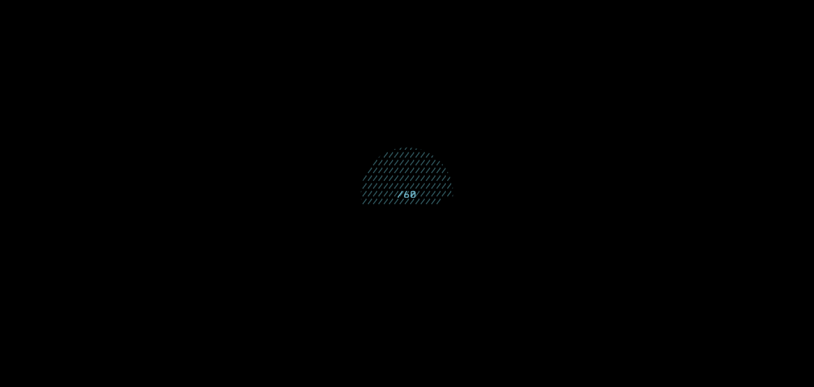

**视觉**：黑色背景，中央一个半球形的虚线网格，中心有进度数字（如 `/60`）。

**实现拆解**：

```
组件：LoadingScreen.vue
```

- **半球形网格**：使用 `THREE.IcosahedronGeometry`（二十面体）或 `THREE.SphereGeometry`，材质为 `THREE.LineSegmentsGeometry` + `THREE.LineDashedMaterial`
  - `dashSize` 和 `gapSize` 控制虚线的节奏感
  - 加载时让半球缓慢旋转（`mesh.rotation.y += 0.005` 写在 `requestAnimationFrame` 里）
  
- **进度数字**：一个 HTML `<div>` 绝对居中，监听资源加载进度（`THREE.LoadingManager` 的 `onProgress` 回调），用 JS 更新文字

- **加载完成过渡**：GSAP 的 `gsap.to()` 让整个 loading overlay 的 `opacity` 从 1 → 0，然后 `display: none`

```typescript
// 伪代码示意
const manager = new THREE.LoadingManager()
manager.onProgress = (url, loaded, total) => {
  progressDiv.textContent = `/${Math.round(loaded / total * 100)}`
}
manager.onLoad = () => {
  gsap.to(loadingOverlay, { opacity: 0, duration: 1, onComplete: () => { 
    loadingOverlay.style.display = 'none' 
  }})
}
```

---

### 截图 01 — 首屏 Header（初始视角）

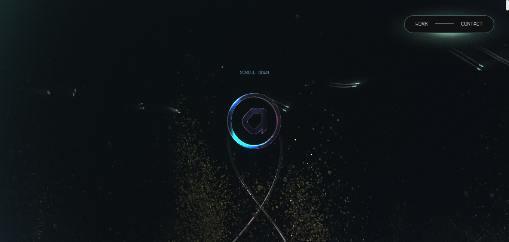

**视觉**：黑色宇宙背景，中央一个彩虹光泽的圆环（Torus），环内有品牌 Logo，环下方有两根交叉的金属线缆构成"X"形，周围散布金黄色粒子。右上角导航胶囊按钮。

这是整个页面最核心的"主角"——**中央几何体系统**，由三个子组件构成：

---

#### 子组件 A：虹彩圆环（Holographic Torus）

这是视觉上最抓眼球的部分，其关键是**虹彩/彩虹漫反射 shader**。

```typescript
// 使用 THREE.MeshPhysicalMaterial 的物理材质参数
const ringMaterial = new THREE.MeshPhysicalMaterial({
  transmission: 0.95,     // 透光度（玻璃感）
  thickness: 0.5,          // 光线穿透厚度
  roughness: 0.05,         // 极光滑
  metalness: 0.1,
  iridescence: 1.0,        // 虹彩强度（Three.js r152+ 支持）
  iridescenceIOR: 1.5,     // 薄膜折射率
  iridescenceThicknessRange: [100, 800], // 薄膜厚度范围（控制彩虹宽度）
  envMapIntensity: 2.0,    // 环境贴图强度
})

const ringGeometry = new THREE.TorusGeometry(1, 0.15, 128, 256)
const ring = new THREE.Mesh(ringGeometry, ringMaterial)
```

> **`iridescence`（虹彩）** 是模拟薄膜干涉（thin-film interference）的物理效果，就像肥皂泡或 CD 盘表面的彩虹色。Three.js 的 `MeshPhysicalMaterial` 原生支持这个参数。

或者，更高级的做法是写自定义 GLSL Shader：

```glsl
// fragment shader 核心逻辑（菲涅尔 + 彩虹映射）
float fresnel = pow(1.0 - dot(vNormal, vViewDir), 3.0);
vec3 rainbow = hsvToRgb(vec3(fresnel + uTime * 0.1, 1.0, 1.0));
gl_FragColor = vec4(rainbow * fresnel, fresnel);
```

---

#### 子组件 B：交叉线缆（X-Wire Structure）

圆环下方悬垂的两根交叉金属线，构成"X"形。

```typescript
// 用贝塞尔曲线定义线缆路径
const curve1 = new THREE.CatmullRomCurve3([
  new THREE.Vector3(-0.5, -0.2, 0),
  new THREE.Vector3(0,    -0.8, 0.2),
  new THREE.Vector3(0.5,  -1.5, 0),
])

// 沿曲线生成管道几何体
const tubeGeo = new THREE.TubeGeometry(curve1, 64, 0.005, 8, false)
const wireMat = new THREE.MeshPhysicalMaterial({
  color: 0x888888,
  metalness: 1.0,
  roughness: 0.2,
  transmission: 0.3,
})
```

---

#### 子组件 C：粒子云（Particle System）

散布在中央几何体周围的金黄色/绿色粒子群。

```typescript
const PARTICLE_COUNT = 8000

// 初始化粒子位置（球形分布）
const positions = new Float32Array(PARTICLE_COUNT * 3)
for (let i = 0; i < PARTICLE_COUNT; i++) {
  const r = Math.random() * 3 + 0.5  // 半径范围
  const theta = Math.random() * Math.PI * 2
  const phi = Math.acos(2 * Math.random() - 1)
  positions[i * 3]     = r * Math.sin(phi) * Math.cos(theta)
  positions[i * 3 + 1] = r * Math.sin(phi) * Math.sin(theta)
  positions[i * 3 + 2] = r * Math.cos(phi)
}

const particleGeo = new THREE.BufferGeometry()
particleGeo.setAttribute('position', new THREE.BufferAttribute(positions, 3))

const particleMat = new THREE.PointsMaterial({
  color: 0xaaff44,
  size: 0.02,
  transparent: true,
  opacity: 0.6,
  blending: THREE.AdditiveBlending,  // 叠加混合让粒子发光
  sizeAttenuation: true,
})

const particles = new THREE.Points(particleGeo, particleMat)
scene.add(particles)
```

**`AdditiveBlending`（加法混合）** 是粒子"发光感"的关键：多个粒子重叠时颜色叠加变亮，形成自然的光晕效果。

---

#### 子组件 D：呼吸灯光效（Breathing Light）

环绕中央物体的"呼吸"感光效。

```typescript
// 在动画循环中，用 sin 函数驱动灯光强度
const ambientLight = new THREE.PointLight(0x4488ff, 2, 5)
scene.add(ambientLight)

function animate(time: number) {
  // Math.sin 产生 -1~1 的周期波，映射到 1~3 的强度范围
  ambientLight.intensity = 2 + Math.sin(time * 0.001) * 1
  renderer.render(scene, camera)
  requestAnimationFrame(animate)
}
```

---

#### 导航栏（HTML 层）

右上角的"WORK ——— CONTACT"胶囊按钮是纯 HTML/CSS，不是 Three.js 渲染的。

```css
/* 胶囊形导航 */
.nav-pill {
  position: fixed;
  top: 20px; right: 20px;
  border: 1px solid rgba(255,255,255,0.3);
  border-radius: 999px;
  padding: 8px 20px;
  backdrop-filter: blur(10px);
  color: white;
  font-family: monospace;
  letter-spacing: 0.2em;
}
```

---

### 截图 02-04 — Scroll 驱动的相机下潜

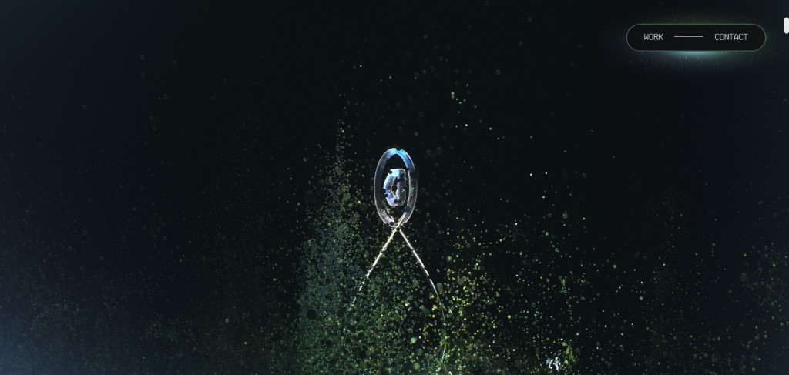
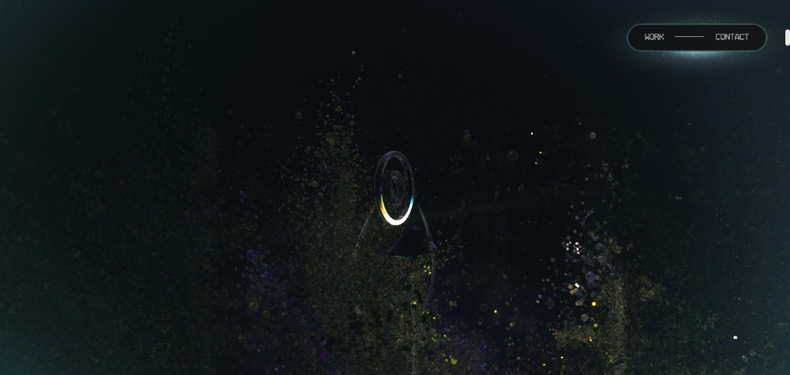
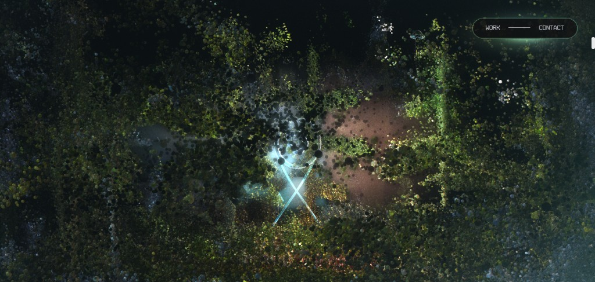

**视觉**：随着用户向下滚动，相机从远处高位俯冲进入粒子云，视角从正面→斜侧→俯视，粒子密度爆炸式增长，整个屏幕被粒子填满。

**实现拆解**：这一段是 **GSAP ScrollTrigger** 的核心应用场景。

```typescript
import gsap from 'gsap'
import { ScrollTrigger } from 'gsap/ScrollTrigger'
gsap.registerPlugin(ScrollTrigger)

// 创建一个"空"的代理对象来接收 GSAP 的数值
const scrollState = { progress: 0 }

gsap.to(scrollState, {
  progress: 1,
  ease: 'none',
  scrollTrigger: {
    trigger: document.body,
    start: 'top top',
    end: 'bottom bottom',
    scrub: 1,           // scrub: 数值越大，动画跟随滚动越"懒"（有惯性）
    onUpdate: (self) => {
      updateCameraFromScroll(self.progress)
    }
  }
})

function updateCameraFromScroll(progress: number) {
  // 第一段（0 → 0.3）：相机从高处俯冲向下
  if (progress < 0.3) {
    const t = progress / 0.3
    camera.position.y = gsap.utils.interpolate(5, -2, t)
    camera.position.z = gsap.utils.interpolate(8, 3, t)
    camera.rotation.x = gsap.utils.interpolate(0, -0.3, t)
  }
  // 第二段（0.3 → 0.5）：旋转并穿越粒子云
  else if (progress < 0.5) {
    const t = (progress - 0.3) / 0.2
    camera.rotation.z = gsap.utils.interpolate(0, Math.PI, t)
    // ...
  }
}
```

**粒子在 scroll 时"爆发"** 的效果：

```typescript
// 随 scroll progress 改变粒子的速度/散布半径
function updateParticles(progress: number) {
  const positions = particleGeo.attributes.position.array as Float32Array
  for (let i = 0; i < PARTICLE_COUNT; i++) {
    // 粒子向外飞散的程度随 progress 增加
    const expandFactor = 1 + progress * 3
    positions[i * 3]     = initialPositions[i * 3]     * expandFactor
    positions[i * 3 + 1] = initialPositions[i * 3 + 1] * expandFactor
    positions[i * 3 + 2] = initialPositions[i * 3 + 2] * expandFactor
  }
  particleGeo.attributes.position.needsUpdate = true
}
```

---

### 截图 05-06 — 场景过渡："卷帘门"效果

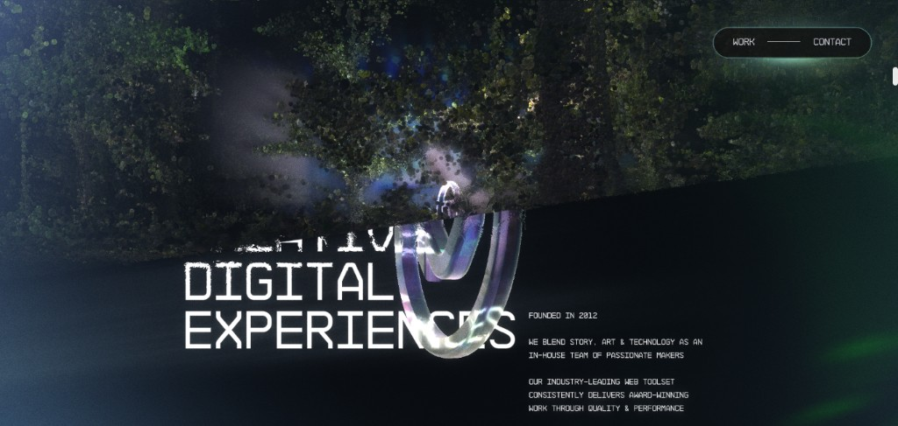
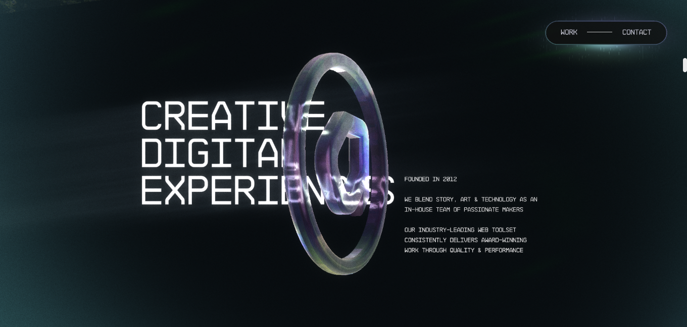

**视觉**：从鸟瞰粒子云中，画面从上到下被"揭开"，露出下方的 About 介绍区域——大标题"CREATIVE DIGITAL EXPERIENCES"从左侧推入，圆环现在变成了从正面看的大型玻璃圆环。这就是"卷帘门"效果。

**实现拆解**：

"卷帘门"（Curtain/Wipe）有两种常见做法：

**方案 A（CSS clip-path，推荐）**：

```typescript
// HTML 中有一个黑色全屏遮罩层
// <div class="curtain-overlay"></div>

gsap.to('.curtain-overlay', {
  clipPath: 'inset(0% 0% 100% 0%)',  // 从上往下收起（露出下面内容）
  ease: 'power2.inOut',
  duration: 1.2,
  scrollTrigger: {
    trigger: body,
    start: '30% top',
    end: '50% top',
    scrub: 0.5,
  }
})
```

`inset(top right bottom left)` 中，把 bottom 从 0% 动画到 100% 就是"从下往上拉起帘子"的效果。

**方案 B（Three.js 平面遮罩）**：

在 Three.js 场景中添加一个巨大的黑色平面，让它随 scroll 向上移动，露出下面的场景。

---

**About 区域文字动画**：

大标题的"逐字打印"或"故障字体"效果：

```typescript
// 字符随机替换 → 逐渐显示正确字符（Glitch 效果）
function glitchReveal(element: HTMLElement, finalText: string) {
  const chars = 'ABCDEFGHIJKLMNOPQRSTUVWXYZ0123456789!@#$%'
  let iteration = 0
  
  const interval = setInterval(() => {
    element.textContent = finalText.split('').map((char, i) => {
      if (i < iteration) return char
      return chars[Math.floor(Math.random() * chars.length)]
    }).join('')
    
    if (iteration >= finalText.length) clearInterval(interval)
    iteration += 0.3
  }, 30)
}
```

---

### 截图 07-11 — Portfolio 展示区：浮动卡片轮播

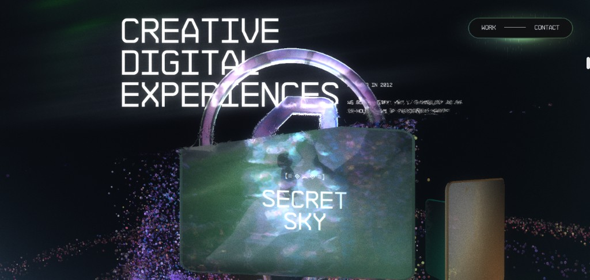
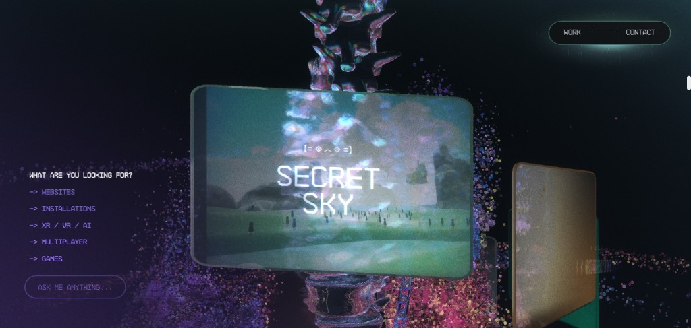
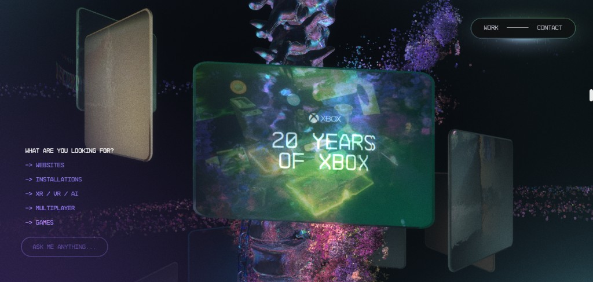
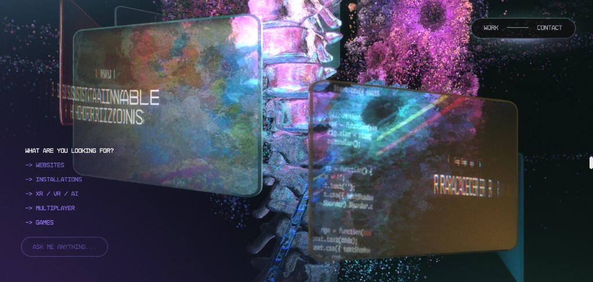
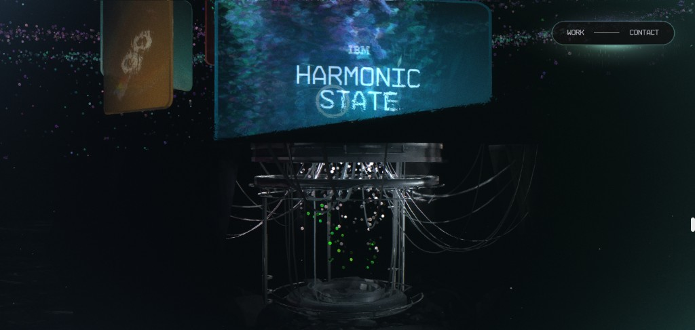

**视觉**：一系列"磨砂玻璃"风格的矩形卡片在 3D 空间中排布，围绕中央的骨骼/机械结构旋转。随着 scroll，卡片一张一张滑入正中央视野，背后的粒子颜色变成紫色调。左侧有 HTML 分类菜单。

这是整个页面工程量最重的部分。

---

#### 子组件 E：磨砂玻璃展示卡片（Display Cards）

```typescript
// 每张卡片是一个 Three.js Mesh
function createDisplayCard(imageUrl: string) {
  const geo = new THREE.PlaneGeometry(2.5, 1.6, 1, 1)
  
  // 加载项目缩略图作为纹理
  const texture = new THREE.TextureLoader().load(imageUrl)
  
  const mat = new THREE.MeshPhysicalMaterial({
    map: texture,
    transmission: 0.4,        // 半透明
    roughness: 0.3,            // 磨砂感
    thickness: 0.2,
    transparent: true,
    opacity: 0.85,
    side: THREE.DoubleSide,
  })
  
  // 圆角效果：用自定义 Shape + ShapeGeometry 代替 PlaneGeometry
  const shape = new THREE.Shape()
  const r = 0.1  // 圆角半径
  shape.moveTo(-1.25 + r, -0.8)
  shape.lineTo(1.25 - r, -0.8)
  shape.quadraticCurveTo(1.25, -0.8, 1.25, -0.8 + r)
  // ... 四个角依次画
  
  return new THREE.Mesh(geo, mat)
}
```

---

#### 子组件 F：卡片轨道系统（Card Orbit）

多张卡片排布在以中央物体为圆心的弧形轨道上，相机固定，卡片群随 scroll 旋转：

```typescript
const CARD_COUNT = 8
const ORBIT_RADIUS = 4
const cards: THREE.Mesh[] = []

// 初始化：沿圆弧等间距放置卡片
for (let i = 0; i < CARD_COUNT; i++) {
  const angle = (i / CARD_COUNT) * Math.PI * 2
  const card = createDisplayCard(projectImages[i])
  
  card.position.set(
    Math.sin(angle) * ORBIT_RADIUS,
    0,
    Math.cos(angle) * ORBIT_RADIUS,
  )
  card.lookAt(0, 0, 0)  // 让卡片面朝圆心
  cards.push(card)
  cardGroup.add(card)
}
scene.add(cardGroup)

// scroll 驱动轨道旋转
function updateCardOrbit(progress: number) {
  // progress 从 0.5 → 1.0 对应整个卡片展示阶段
  const orbitProgress = (progress - 0.5) / 0.5
  cardGroup.rotation.y = orbitProgress * Math.PI * 2
}
```

**卡片进入视野时的放大/高亮**：检测每张卡片是否最接近相机正前方，对最近的卡片做放大处理：

```typescript
function highlightNearestCard() {
  const cameraDir = new THREE.Vector3(0, 0, -1).applyQuaternion(camera.quaternion)
  
  cards.forEach(card => {
    const cardDir = card.position.clone().normalize()
    const dot = cameraDir.dot(cardDir)  // dot product 越接近 1，代表正对相机
    
    const scale = dot > 0.9 ? 1.15 : 1.0
    gsap.to(card.scale, { x: scale, y: scale, z: scale, duration: 0.3 })
  })
}
```

---

#### 子组件 G：中央骨骼/机械结构（Central Skeleton）

截图 10 中清晰可见一个脊椎骨骼（vertebrae）3D 模型，截图 11 中是量子计算机状的机械结构。这些是**预制的 GLTF 3D 模型**，用 Three.js 的 `GLTFLoader` 加载：

```typescript
import { GLTFLoader } from 'three/examples/jsm/loaders/GLTFLoader'
import { DRACOLoader } from 'three/examples/jsm/loaders/DRACOLoader'

const dracoLoader = new DRACOLoader()
dracoLoader.setDecoderPath('/draco/')  // Draco 压缩解码器，减小模型体积

const gltfLoader = new GLTFLoader()
gltfLoader.setDRACOLoader(dracoLoader)

gltfLoader.load('/models/skeleton.glb', (gltf) => {
  const model = gltf.scene
  model.position.set(0, -1, 0)
  model.scale.set(0.5, 0.5, 0.5)
  scene.add(model)
  
  // 给模型的每个子 mesh 应用自定义材质
  model.traverse((child) => {
    if (child instanceof THREE.Mesh) {
      child.material = new THREE.MeshStandardMaterial({
        color: 0xcccccc,
        metalness: 0.8,
        roughness: 0.3,
      })
    }
  })
})
```

---

#### 子组件 H：左侧 HTML 分类菜单

"WHAT ARE YOU LOOKING FOR? → WEBSITES → INSTALLATIONS ..."这个菜单是**纯 HTML**，固定定位在左侧，通过 GSAP 在进入卡片展示区时 fade in：

```typescript
// 进入卡片区时，让菜单淡入
ScrollTrigger.create({
  trigger: body,
  start: '55% top',
  onEnter: () => gsap.to('.category-menu', { opacity: 1, x: 0, duration: 0.6 }),
  onLeaveBack: () => gsap.to('.category-menu', { opacity: 0, x: -30, duration: 0.4 }),
})
```

---

## 鼠标交互：空间扭曲与粒子释放

鼠标在页面上移动时，附近的粒子会被"推开"，产生空间扭曲感。

```typescript
// 把鼠标 2D 坐标转换成 3D 射线
const raycaster = new THREE.Raycaster()
const mouse = new THREE.Vector2()

window.addEventListener('mousemove', (e) => {
  mouse.x = (e.clientX / window.innerWidth) * 2 - 1
  mouse.y = -(e.clientY / window.innerHeight) * 2 + 1
})

// 在动画循环中，对每帧的粒子施加鼠标排斥力
function applyMouseRepulsion() {
  // 用 unproject 把鼠标位置转换到 3D 空间中
  const mousePos3D = new THREE.Vector3(mouse.x, mouse.y, 0.5)
  mousePos3D.unproject(camera)
  
  const positions = particleGeo.attributes.position.array as Float32Array
  
  for (let i = 0; i < PARTICLE_COUNT; i++) {
    const px = positions[i * 3]
    const py = positions[i * 3 + 1]
    const pz = positions[i * 3 + 2]
    
    const dx = px - mousePos3D.x
    const dy = py - mousePos3D.y
    const dist = Math.sqrt(dx * dx + dy * dy)
    
    if (dist < REPULSION_RADIUS) {
      const force = (REPULSION_RADIUS - dist) / REPULSION_RADIUS
      velocities[i * 3]     += dx * force * 0.01
      velocities[i * 3 + 1] += dy * force * 0.01
    }
    
    // 粒子位置 += 速度；速度 *= 阻尼（让粒子弹回原位）
    positions[i * 3]     += velocities[i * 3]
    positions[i * 3 + 1] += velocities[i * 3 + 1]
    velocities[i * 3]     *= 0.95  // 阻尼
    velocities[i * 3 + 1] *= 0.95
  }
  
  particleGeo.attributes.position.needsUpdate = true
}
```

**相机视差（Parallax）**：鼠标移动时相机轻微偏转，增强空间感：

```typescript
let targetCameraX = 0, targetCameraY = 0

window.addEventListener('mousemove', (e) => {
  targetCameraX = (e.clientX / window.innerWidth - 0.5) * 0.3
  targetCameraY = -(e.clientY / window.innerHeight - 0.5) * 0.2
})

function animate() {
  // lerp：线性插值让相机平滑跟随（0.05 = 5% 的跟随速度，产生"惯性"）
  camera.rotation.y += (targetCameraX - camera.rotation.y) * 0.05
  camera.rotation.x += (targetCameraY - camera.rotation.x) * 0.05
}
```

---

## 渲染后处理（Post-Processing）

整个画面的"电影感"来自渲染后处理效果，使用 Three.js 的 `EffectComposer`：

```typescript
import { EffectComposer } from 'three/examples/jsm/postprocessing/EffectComposer'
import { RenderPass } from 'three/examples/jsm/postprocessing/RenderPass'
import { UnrealBloomPass } from 'three/examples/jsm/postprocessing/UnrealBloomPass'

const composer = new EffectComposer(renderer)
composer.addPass(new RenderPass(scene, camera))

// Bloom（辉光）：让亮的地方发光扩散，是科技感的关键
const bloomPass = new UnrealBloomPass(
  new THREE.Vector2(window.innerWidth, window.innerHeight),
  1.5,   // strength 辉光强度
  0.4,   // radius 辉光半径
  0.85   // threshold 亮度阈值（只有超过这个亮度才发光）
)
composer.addPass(bloomPass)

// 每帧用 composer.render() 替代 renderer.render()
function animate() {
  composer.render()
  requestAnimationFrame(animate)
}
```

---

## Vue 3 组件结构

所有 3D 逻辑集中在一个 `ThreeScene.vue` 组件中，通过 Vue 的生命周期管理初始化和销毁：

```
src/
├── App.vue                     # 根组件，组合所有层
├── components/
│   ├── ThreeScene.vue           # Three.js 主场景（canvas 层）
│   ├── LoadingOverlay.vue       # 加载动画（HTML 层）
│   ├── NavigationBar.vue        # 右上角导航（HTML 层）
│   ├── HeroText.vue             # Header 区标题文字
│   ├── AboutSection.vue         # About 区文字内容
│   ├── CategoryMenu.vue         # 卡片区左侧菜单
│   └── CurtainOverlay.vue       # 卷帘门遮罩层
└── composables/
    ├── useThreeScene.ts          # Three.js 场景的创建逻辑
    ├── useScrollAnimation.ts     # GSAP ScrollTrigger 配置
    ├── useParticleSystem.ts      # 粒子系统
    └── useMouseInteraction.ts    # 鼠标交互
```

```vue
<!-- ThreeScene.vue 骨架 -->
<template>
  <canvas ref="canvasRef" class="three-canvas" />
</template>

<script setup lang="ts">
import { ref, onMounted, onUnmounted } from 'vue'
import { useThreeScene } from '@/composables/useThreeScene'
import { useScrollAnimation } from '@/composables/useScrollAnimation'

const canvasRef = ref<HTMLCanvasElement>()

onMounted(() => {
  const { scene, camera, renderer } = useThreeScene(canvasRef.value!)
  useScrollAnimation(camera, scene)
})

onUnmounted(() => {
  // 清理 Three.js 资源，防止内存泄漏
  renderer.dispose()
  ScrollTrigger.killAll()
})
</script>

<style scoped>
.three-canvas {
  position: fixed;
  top: 0; left: 0;
  width: 100%; height: 100%;
  z-index: 0;
}
</style>
```

---

## 知识点速查表

| 效果 | 技术方案 |
|------|---------|
| 虹彩玻璃材质 | `MeshPhysicalMaterial` + `iridescence` |
| 磨砂透明卡片 | `MeshPhysicalMaterial` + `transmission` + `roughness` |
| 粒子云 | `BufferGeometry` + `Points` + `AdditiveBlending` |
| 粒子发光感 | `AdditiveBlending` 加法混合 |
| 全局辉光 | `UnrealBloomPass`（EffectComposer 后处理）|
| Scroll 驱动相机 | GSAP `ScrollTrigger` + `scrub` |
| 卷帘门过渡 | GSAP 动画 CSS `clip-path: inset()` |
| 线缆/管道 | `CatmullRomCurve3` + `TubeGeometry` |
| 3D 模型（骨骼/机械） | `GLTFLoader` 加载 `.glb` 文件 |
| 鼠标粒子排斥 | `Vector3.unproject()` + 逐粒子距离检测 |
| 相机视差 | `mousemove` + `lerp` 平滑跟随 |
| 呼吸灯 | `Math.sin(time)` 驱动 `PointLight.intensity` |
| 字符 Glitch 效果 | 随机字符替换 + setInterval 逐步收敛 |
